# Art Influence Project: Visual Flow and Religious Motif Continuity

This project explores how visual motifs may appear continuously across Renaissance-related art styles using WikiArt images and CLIP visual embeddings.

The current project is **not trying to prove direct artistic influence**.  
A safer and more art-historically acceptable framing is:

> **Religious Motif Continuity**  
> instead of  
> **Influence Network**

The main idea is:

> Use image embeddings and retrieval networks to identify possible visual-motif continuity across styles, especially in religious paintings.

---

## 1. Current Research Direction

At the beginning, the project considered the idea of an **Influence Network**:

```text
artist/style A → artist/style B
```

But this wording is too strong because visual similarity alone cannot prove historical influence.

CLIP can show:

- two images are visually similar,
- two styles share similar compositions,
- certain motifs appear across different styles,
- some styles retrieve each other frequently.

But CLIP cannot prove:

- one artist saw another artist’s work,
- one painting directly influenced another,
- a historical transmission path actually existed.

So the current preferred direction is:

```text
Religious Motif Continuity
Cross-Style Visual Flow
Motif-Level Visual Retrieval
```

The most promising paper route is:

> **Tracing Religious Motif Continuity Across Renaissance-Related Styles through CLIP-Based Visual Retrieval**

---

## 2. Project Structure

```text
art_influence_project/
├── data/
│   ├── raw/
│   ├── metadata/
│   │   └── wikiart_metadata_clean_v1.csv
│   └── processed/
│       ├── wikiart_renaissance_subset_v1.csv
│       └── embeddings/
│           ├── clip_renaissance_subset_v1.npy
│           ├── clip_renaissance_subset_metadata_v1.csv
│           └── clip_renaissance_subset_metadata_with_phash_v1.csv
│
├── outputs/
│   ├── tables/
│   ├── figures/
│   ├── figures/edge_cases/
│   ├── figures/edge_cases_dedup/
│   └── figures/edge_cases_diverse/
│
├── scripts/
│   ├── 00_check_dataset.py
│   ├── ....
│
├── requirements.txt
└── README.md
```

---

## 3. Data and Main Tables

### 3.1 Dataset

The project uses:

```text
huggan/wikiart
```

Current focused subset:

```text
Early_Renaissance
High_Renaissance
Northern_Renaissance
Mannerism_Late_Renaissance
Baroque
Rococo
```

Current subset size:

```text
7200 images
1200 images per style
```

CLIP embedding shape:

```text
(7200, 512)
```

---

### 3.2 Metadata Tables

| File | Description |
|---|---|
| `data/metadata/wikiart_metadata_clean_v1.csv` | Clean metadata with readable artist, genre, and style names |
| `data/processed/wikiart_renaissance_subset_v1.csv` | Balanced Renaissance-related subset |
| `data/processed/embeddings/clip_renaissance_subset_metadata_v1.csv` | Metadata aligned with CLIP embeddings |
| `data/processed/embeddings/clip_renaissance_subset_metadata_with_phash_v1.csv` | Metadata with perceptual-hash duplicate groups |

---

### 3.3 Result Tables

| File | Description |
|---|---|
| `outputs/tables/style_similarity_matrix_v1.csv` | Style centroid cosine similarity matrix |
| `outputs/tables/cross_style_retrieval_flow_v1.csv` | Row-normalized cross-style retrieval flow |
| `outputs/tables/style_order_constrained_flow_summary_v1.csv` | Directed visual flow using simplified style order |
| `outputs/tables/religious_only_cross_style_retrieval_flow_v1.csv` | Retrieval flow using only religious paintings |
| `outputs/tables/full_vs_religious_flow_comparison_v1.csv` | Comparison between full subset and religious-only subset |
| `outputs/tables/top1_predecessor_flow_summary_v1.csv` | Each target image keeps only one strongest cross-style predecessor |
| `outputs/tables/religious_top1_predecessor_flow_summary_v1.csv` | Religious-only top-1 predecessor flow |
| `outputs/tables/edge_genre_composition_v1.csv` | Genre composition of major visual-flow edges |
| `outputs/tables/style_order_constrained_edges_dedup_v1.csv` | Deduplicated edge-level table |
| `outputs/tables/top1_predecessor_edges_v1.csv` | Edge-level table for top-1 predecessor analysis |

---

## 4. Current Figures

### 4.1 CLIP Retrieval Case Study

File:

```text
outputs/figures/clip_retrieval_case_study_v1.png
```

Image:

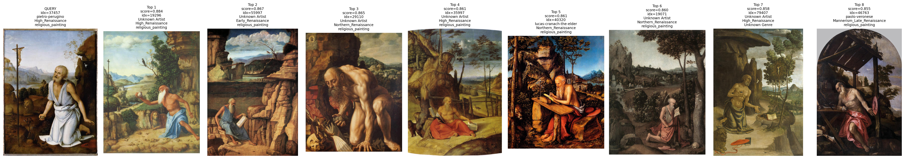

Purpose:

- Shows one query image and its top retrieved images.
- Demonstrates that CLIP retrieves visually similar works across related styles.
- Initial evidence that religious compositions can be retrieved across style boundaries.

---

### 4.2 Style Similarity Matrix

File:

```text
outputs/figures/style_similarity_matrix_v1.png
```

Image:

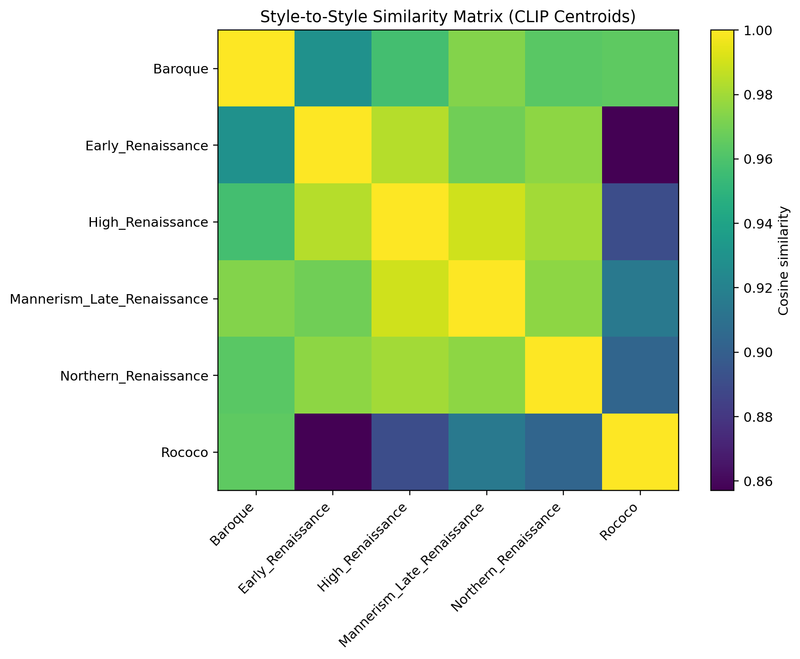

Purpose:

- Computes style centroid similarity.
- Shows that Renaissance-related styles are close in CLIP space.
- Rococo is relatively farther from Early and High Renaissance.

Important values:

```text
High_Renaissance ↔ Mannerism_Late_Renaissance = 0.9895
Early_Renaissance ↔ High_Renaissance = 0.9843
High_Renaissance ↔ Northern_Renaissance = 0.9802
Early_Renaissance ↔ Rococo = 0.8571
```

---

### 4.3 Cross-Style Retrieval Flow

File:

```text
outputs/figures/cross_style_retrieval_flow_v1.png
```

Image:

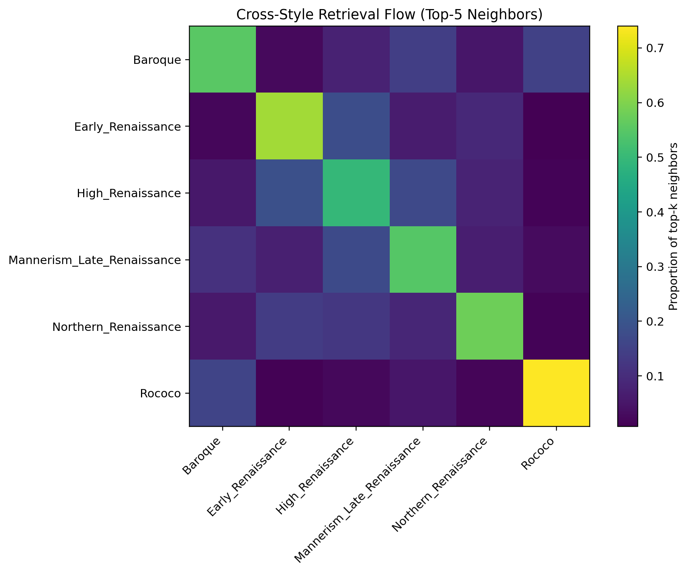

Purpose:

- For each image, retrieve top-5 nearest neighbors.
- Count which styles appear among the neighbors.
- Shows style self-retrieval and cross-style visual links.

Current observation:

- Every style retrieves itself strongly.
- High Renaissance connects to Early Renaissance, Northern Renaissance, and Mannerism / Late Renaissance.
- Rococo is relatively self-contained in the full subset.

---

### 4.4 Pretty Directed Visual Flow Network

File:

```text
outputs/figures/style_flow_network_pretty_v1.png
```

Image:

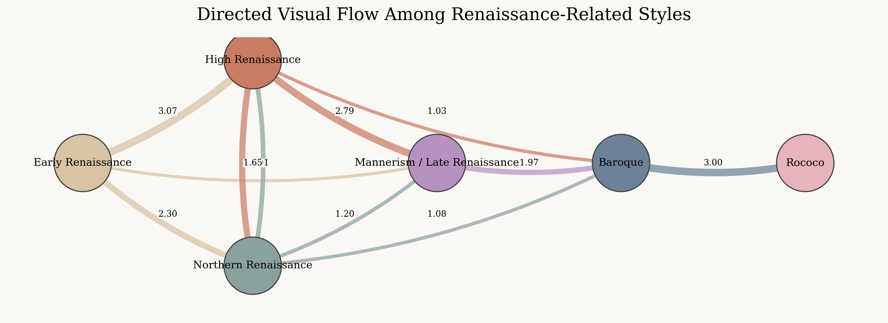

Purpose:

- Uses a simplified art-historical order.
- Draws a directed visual-flow network.
- This is an early visual-flow graph, but still too broad because it mixes genres.

Important edges:

```text
Early_Renaissance → High_Renaissance = 3.07
High_Renaissance → Mannerism_Late_Renaissance = 2.79
Early_Renaissance → Northern_Renaissance = 2.30
Mannerism_Late_Renaissance → Baroque = 1.97
Baroque → Rococo = 3.00
```

---

### 4.5 Religious-Only Cross-Style Retrieval Flow

File:

```text
outputs/figures/religious_only_cross_style_retrieval_flow_v1.png
```

Image:

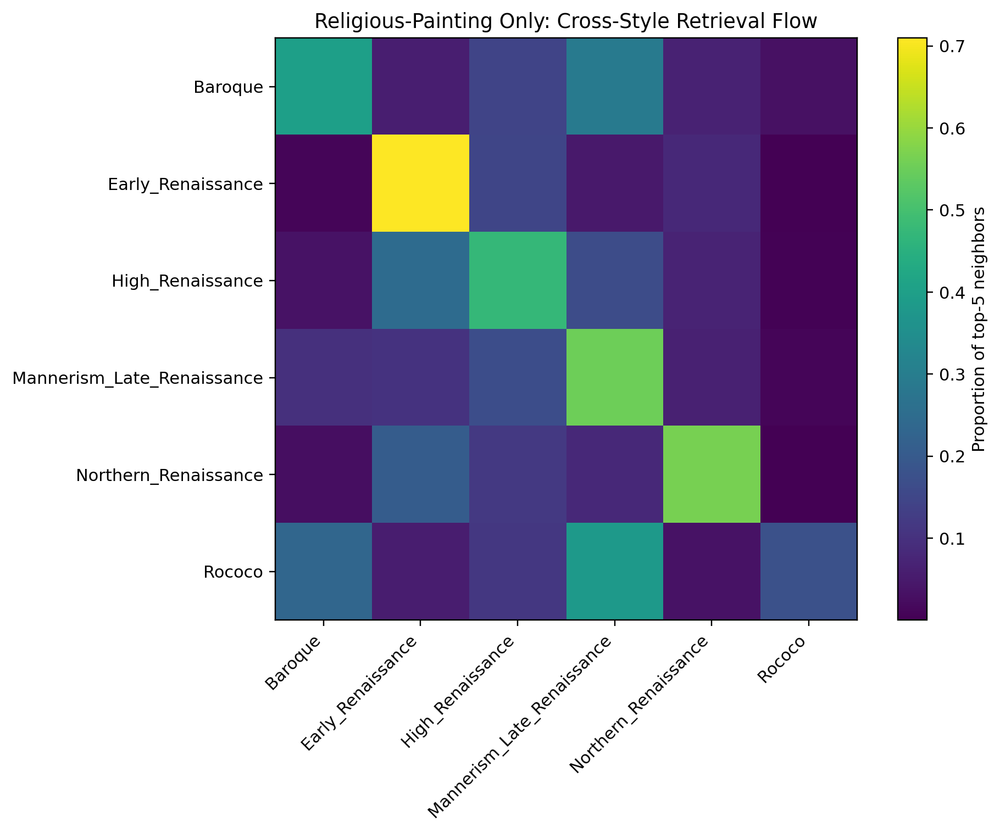

Purpose:

- Controls for genre by keeping only `religious_painting`.
- Tests whether the main structure still exists within religious paintings.

Religious-only subset:

```text
3105 images
```

Style counts:

```text
Early_Renaissance             951
High_Renaissance              616
Northern_Renaissance          599
Mannerism_Late_Renaissance    589
Baroque                       291
Rococo                         59
```

Observation:

- Early → High remains strong.
- Early → Northern remains strong.
- High → Mannerism remains strong.
- Mannerism → Baroque remains strong.
- Rococo religious results are less stable because Rococo has only 59 religious paintings.

---

### 4.6 Full vs Religious-Only Flow Comparison

File:

```text
outputs/figures/full_vs_religious_flow_comparison_v1.png
```

Image:

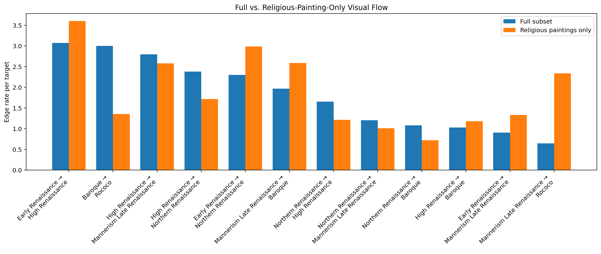

Purpose:

- Compares full-subset visual flow with religious-only visual flow.
- Shows which edges remain strong after controlling for religious genre.

Important comparison:

```text
Early_Renaissance → High_Renaissance:
full = 3.0717
religious-only = 3.6039

Early_Renaissance → Northern_Renaissance:
full = 2.2992
religious-only = 2.9866

Mannerism_Late_Renaissance → Baroque:
full = 1.9683
religious-only = 2.5876

Baroque → Rococo:
full = 3.0025
religious-only = 1.3559
```

Interpretation:

- Renaissance-related religious motif flows become stronger in the religious-only subset.
- Baroque → Rococo becomes weaker, meaning it is probably not mainly a religious-motif flow.

---

### 4.7 Top-1 Cross-Style Predecessor Flow

File:

```text
outputs/figures/top1_predecessor_flow_matrix_v1.png
```

Image:

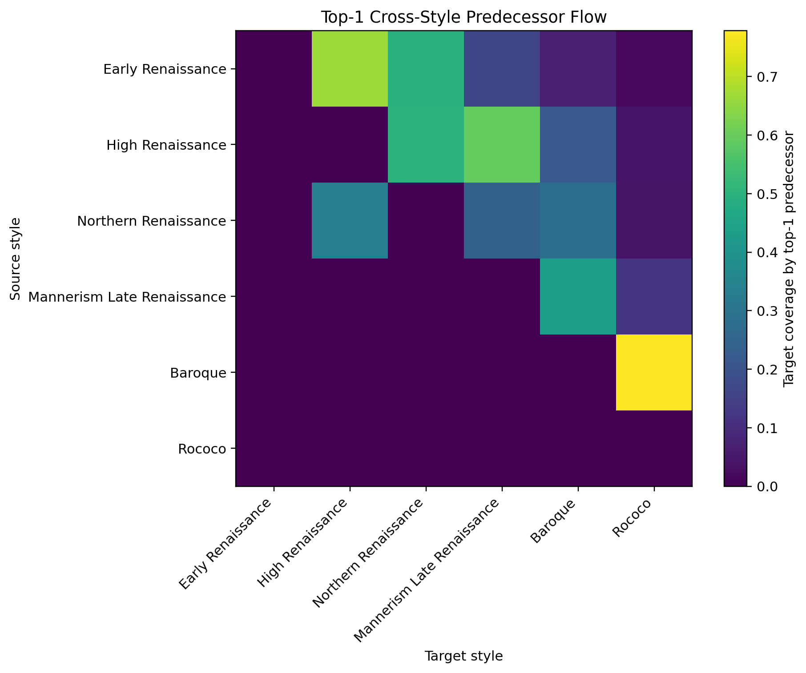

Purpose:

- Each target image keeps only one strongest cross-style predecessor.
- This avoids inflating edge counts by allowing many neighbors per target.

Important values:

```text
Baroque → Rococo = 0.7783
Early_Renaissance → High_Renaissance = 0.6658
High_Renaissance → Mannerism_Late_Renaissance = 0.5958
High_Renaissance → Northern_Renaissance = 0.5025
Early_Renaissance → Northern_Renaissance = 0.4975
Mannerism_Late_Renaissance → Baroque = 0.4325
```

Observation:

- The main structure remains even under stricter top-1 predecessor analysis.
- Baroque → Rococo is strong in the full subset, but later genre analysis shows it is not mainly religious.

---

### 4.8 Religious-Only Top-1 Predecessor Flow

File:

```text
outputs/figures/religious_top1_predecessor_flow_matrix_v1.png
```

Image:

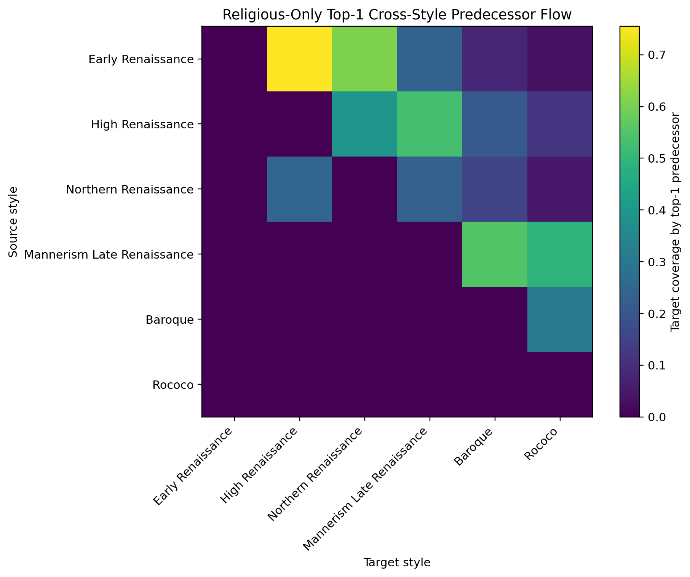

Purpose:

- The strictest main analysis so far.
- Only religious paintings are used.
- Each target image keeps only one strongest cross-style predecessor.

Important values:

```text
Early_Renaissance → High_Renaissance = 0.7549
Early_Renaissance → Northern_Renaissance = 0.6077
Mannerism_Late_Renaissance → Baroque = 0.5498
High_Renaissance → Mannerism_Late_Renaissance = 0.5331
High_Renaissance → Northern_Renaissance = 0.3923
```

Interpretation:

- This is one of the strongest pieces of evidence for the current project.
- It supports the idea of religious motif continuity across Renaissance-related styles.

---

### 4.9 Final Religious-Motif Visual Flow Network

File:

```text
outputs/figures/religious_top1_flow_network_pretty_v1.png
```

Image:

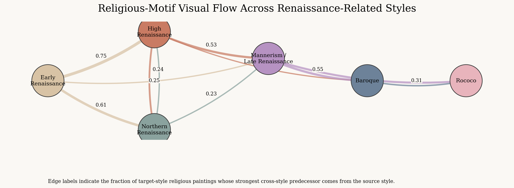

Purpose:

- This is the current main figure.
- It summarizes religious-only top-1 visual flow as a directed network.

Main interpretation:

```text
Early Renaissance → High Renaissance
Early Renaissance → Northern Renaissance
High Renaissance → Mannerism / Late Renaissance
Mannerism / Late Renaissance → Baroque
```

This is the most promising structure for the final paper.

---

## 5. Genre Composition Figures

Genre composition is used to understand what drives each strong edge.

### 5.1 Early Renaissance → High Renaissance

File:

```text
outputs/figures/genre_composition_Early_Renaissance_to_High_Renaissance.png
```

Image:

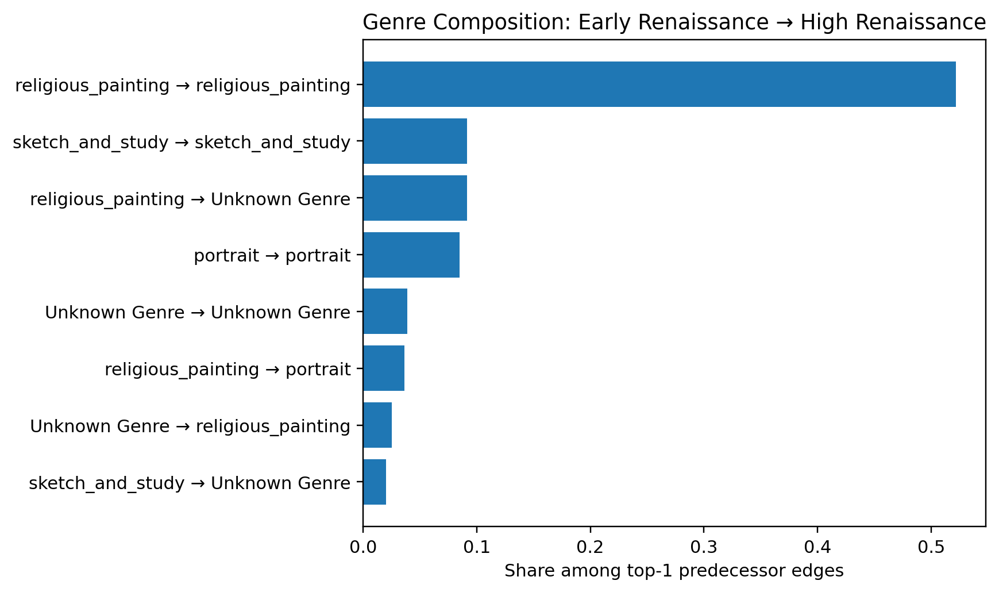

Main result:

```text
religious_painting → religious_painting = 52.19%
```

Interpretation:

- This edge is mainly driven by religious paintings.
- It strongly supports the religious motif continuity route.

---

### 5.2 Early Renaissance → Northern Renaissance

File:

```text
outputs/figures/genre_composition_Early_Renaissance_to_Northern_Renaissance.png
```

Image:

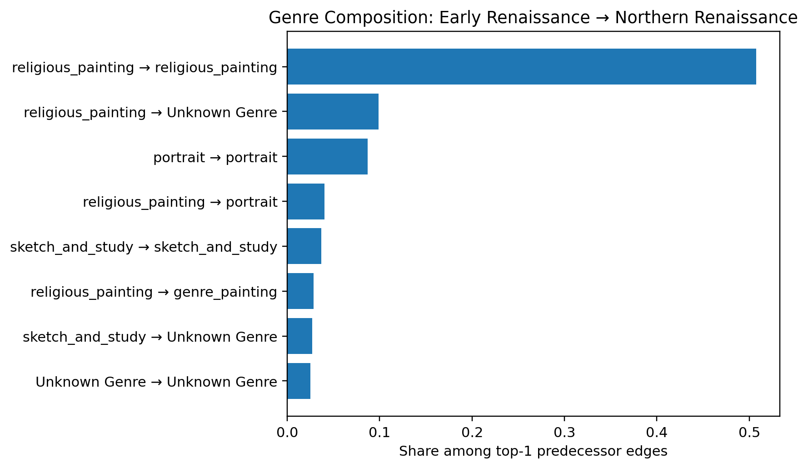

Main result:

```text
religious_painting → religious_painting = 50.75%
```

Interpretation:

- This is one of the most interesting cross-regional findings.
- It suggests religious iconographic continuity between Early Renaissance and Northern Renaissance works.

---

### 5.3 High Renaissance → Mannerism / Late Renaissance

File:

```text
outputs/figures/genre_composition_High_Renaissance_to_Mannerism_Late_Renaissance.png
```

Image:

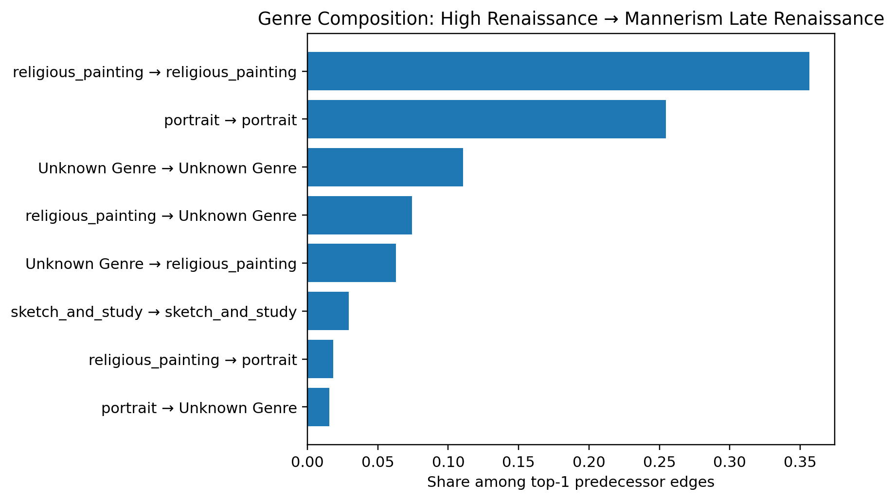

Main results:

```text
religious_painting → religious_painting = 35.66%
portrait → portrait = 25.45%
```

Interpretation:

- This transition is supported by both religious painting and portrait continuity.
- It is not a purely religious edge.

---

### 5.4 Mannerism / Late Renaissance → Baroque

File:

```text
outputs/figures/genre_composition_Mannerism_Late_Renaissance_to_Baroque.png
```

Image:

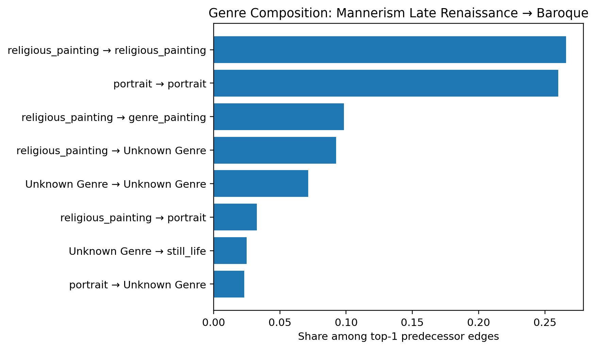

Main results:

```text
religious_painting → religious_painting = 26.59%
portrait → portrait = 26.01%
```

Interpretation:

- This edge is mixed.
- It has religious continuity, but portrait continuity is almost equally important.

---

### 5.5 Baroque → Rococo

File:

```text
outputs/figures/genre_composition_Baroque_to_Rococo.png
```

Image:

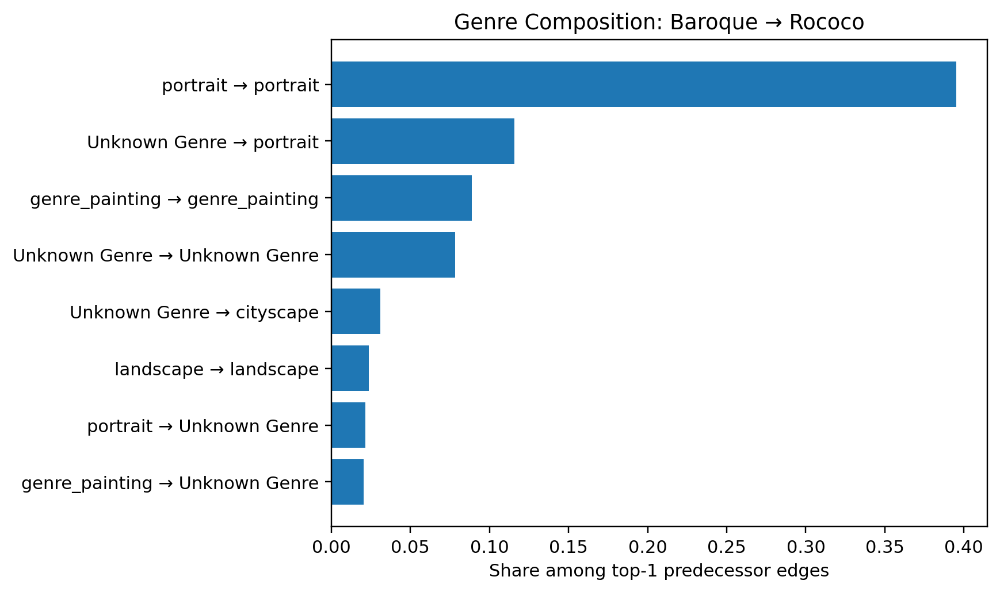

Main results:

```text
portrait → portrait = 39.51%
Unknown Genre → portrait = 11.56%
genre_painting → genre_painting = 8.89%
Unknown Genre → cityscape = 3.10%
```

Interpretation:

- Baroque → Rococo is not mainly part of the religious motif chain.
- It seems to reflect portrait, genre-painting, and some cityscape / urban-view continuity.
- It should be treated as a contrast case rather than the main argument.

---

## 6. Representative Contact Sheets

The contact sheets show concrete image pairs behind the visual-flow edges.

The current best qualitative evidence comes from:

```text
outputs/figures/edge_cases_diverse/
```

### 6.1 Early Renaissance → High Renaissance

File:

```text
outputs/figures/edge_cases_diverse/diverse_edge_case_Early_Renaissance_to_High_Renaissance.png
```

Image:

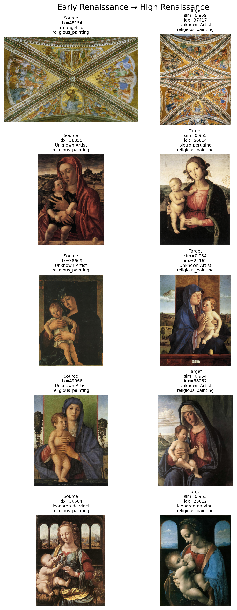

Why it matters:

- Strong Madonna and Child continuity.
- Similar religious figure compositions.
- Includes recognizable artists such as Fra Angelico, Perugino, and Leonardo da Vinci.

---

### 6.2 Early Renaissance → Northern Renaissance

File:

```text
outputs/figures/edge_cases_diverse/diverse_edge_case_Early_Renaissance_to_Northern_Renaissance.png
```

Image:

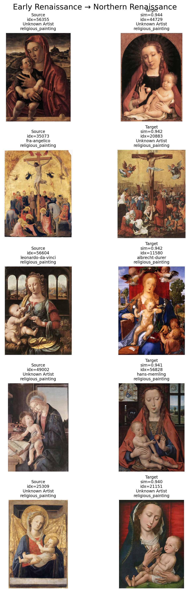

Why it matters:

- Best evidence for cross-regional religious motif continuity.
- Includes Madonna and Child and Crucifixion motifs.
- Includes artists such as Fra Angelico, Leonardo da Vinci, Albrecht Dürer, and Hans Memling.

---

### 6.3 High Renaissance → Mannerism / Late Renaissance

File:

```text
outputs/figures/edge_cases_diverse/diverse_edge_case_High_Renaissance_to_Mannerism_Late_Renaissance.png
```

Image:

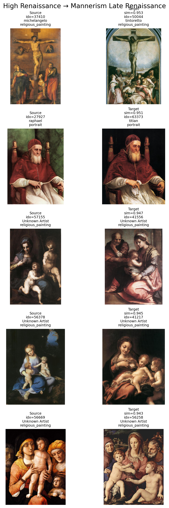

Why it matters:

- Shows continuity in Crucifixion, Madonna group scenes, and portraits.
- Includes Michelangelo, Raphael, Tintoretto, Titian.

---

### 6.4 Mannerism / Late Renaissance → Baroque

File:

```text
outputs/figures/edge_cases_diverse/diverse_edge_case_Mannerism_Late_Renaissance_to_Baroque.png
```

Image:

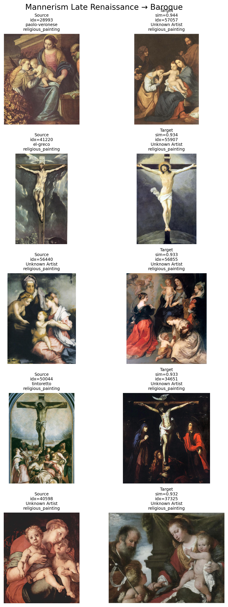

Why it matters:

- Shows religious-scene continuity into Baroque.
- Includes Crucifixion and complex multi-figure religious compositions.
- More mixed than Early → High, but still useful.

---

### 6.5 Baroque → Rococo

File:

```text
outputs/figures/edge_cases_diverse/diverse_edge_case_Baroque_to_Rococo.png
```

Image:

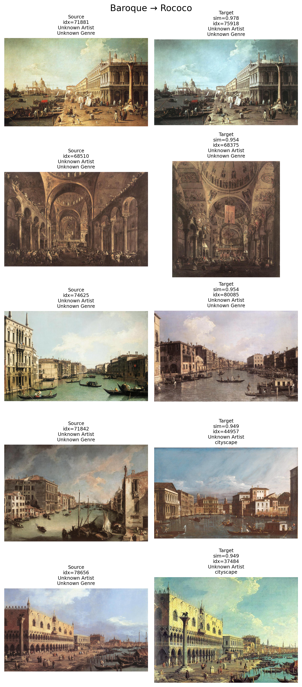

Why it matters:

- Useful as a contrast case.
- Shows portrait / cityscape / architectural-view continuity.
- Not the main evidence for religious motif continuity.

---

## 7. Current Core Argument

The current strongest argument is:

> CLIP-based visual retrieval does not prove direct artistic influence, but it can reveal structured visual continuities across Renaissance-related styles. These continuities are especially strong in religious paintings.

More specifically:

```text
Early Renaissance → High Renaissance
Early Renaissance → Northern Renaissance
High Renaissance → Mannerism / Late Renaissance
Mannerism / Late Renaissance → Baroque
```

The most promising route is to focus on:

```text
religious_painting → religious_painting
```

especially motifs such as:

```text
Madonna and Child
Crucifixion
Virgin and Child
religious figure groups
sacred portrait-like figures
```

---

## 8. Current Problems and Limitations

### 8.1 “Influence” is too strong

The project should not claim direct influence without external art-historical evidence.

Current safer wording:

```text
motif continuity
visual flow
cross-style retrieval
visual predecessor
```

Avoid:

```text
proof of influence
artist A influenced artist B
historical transmission confirmed
```

---

### 8.2 WikiArt metadata is noisy

Many entries include:

```text
Unknown Artist
Unknown Genre
```

This affects interpretation, especially in Baroque and Rococo.

---

### 8.3 Style order is simplified

The current style order is manually defined:

```text
Early Renaissance
High Renaissance / Northern Renaissance
Mannerism / Late Renaissance
Baroque
Rococo
```

This is useful for computation but oversimplifies real art history.

---

### 8.4 Rococo religious subset is small

Only 59 Rococo religious paintings appear in the religious-only subset.

Therefore, Rococo should not be central to the religious-motif argument.

---

### 8.5 Genre and motif are not the same

The project currently uses WikiArt genre labels, but true motif analysis would require more detailed labels, such as:

```text
Madonna and Child
Crucifixion
Annunciation
Pietà
Saint in wilderness
```

---

### 8.6 CLIP may retrieve based on composition, genre, color, or object layout

A high CLIP similarity score does not tell us exactly what visual feature caused the similarity.

That is why qualitative contact sheets are important.

---

## 9. Most Promising Paper Route

The best route is not:

```text
A Computational Influence Network of Renaissance Art
```

That sounds too strong.

The best route is:

```text
Tracing Religious Motif Continuity Across Renaissance-Related Styles through CLIP-Based Visual Retrieval
```

Possible research question:

> Can CLIP-based visual retrieval reveal religious motif continuity across Renaissance-related art styles?

Possible claim:

> The results show that religious paintings form a structured cross-style visual-flow pattern. Early Renaissance religious paintings frequently serve as the strongest visual predecessors for High Renaissance and Northern Renaissance religious paintings, while High Renaissance religious paintings connect strongly to Mannerism / Late Renaissance.

Possible paper structure:

```text
1. Introduction
   - visual influence and motif continuity in art history
   - why computational retrieval can help
   - why this project avoids overclaiming influence

2. Data
   - WikiArt
   - Renaissance-related subset
   - religious-painting subset

3. Method
   - CLIP embeddings
   - cosine similarity
   - top-k retrieval
   - top-1 predecessor flow
   - simplified style order
   - genre composition check
   - qualitative contact sheets

4. Results
   - style similarity matrix
   - cross-style retrieval flow
   - religious-only top-1 flow
   - genre composition
   - representative motif cases

5. Discussion
   - religious motif continuity
   - High Renaissance as visual bridge
   - Early Renaissance to Northern Renaissance as cross-regional continuity
   - Baroque to Rococo as contrast case
   - limitations of CLIP and WikiArt

6. Conclusion
   - CLIP cannot prove influence
   - but it can help discover visual-motif continuity candidates
```

---

## 10. Current Status

```text
Data loading: done
Metadata cleaning: done
Renaissance subset: done
CLIP embedding extraction: done
Style similarity analysis: done
Cross-style retrieval flow: done
Directed visual-flow network: done
Religious-only control: done
Top-1 predecessor flow: done
Genre composition analysis: done
Contact sheets: done
Final paper writing: not started
```

---

## 11. Next Steps

The next useful steps are:

1. Clean figure labels:
   - remove underscores,
   - use consistent capitalization,
   - improve figure captions.

2. Build motif-specific panels:
   - Madonna and Child,
   - Crucifixion,
   - religious group composition.

3. Add manual validation:
   - label whether retrieved pairs share the same motif,
   - estimate precision of retrieval.

4. Possibly add another embedding model:
   - DINOv2,
   - compare with CLIP.

5. Start writing the paper around the religious motif continuity route.

---

## 12. Short GitHub Description

This project uses CLIP image embeddings and WikiArt metadata to study cross-style visual flow across Renaissance-related art styles. Instead of claiming direct artistic influence, it focuses on religious motif continuity, especially among Early Renaissance, High Renaissance, Northern Renaissance, Mannerism / Late Renaissance, and Baroque paintings. The project combines visual retrieval, style-level flow matrices, religious-only controls, top-1 predecessor analysis, genre composition, and qualitative contact sheets.
